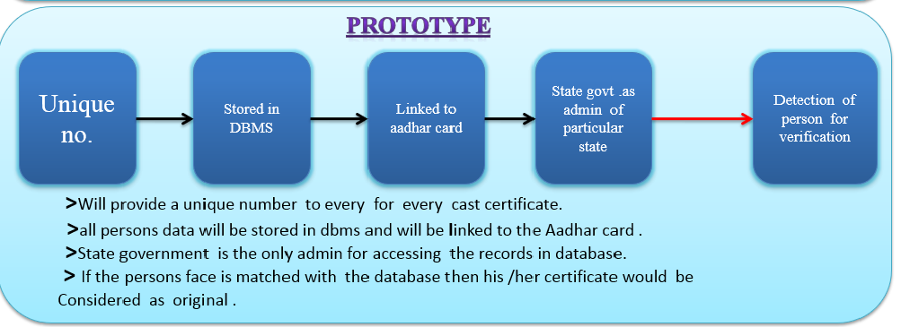

# Online-cast-verification
This is all project about a Goverment office can use this platform to verify the cast certificate that his/her certificate is original or not.

Entire project is written using the following technology
1. MEAN stack
2. Image processing (advance)

Setup the project
1. clone the project from github via the link https://github.com/airrakeshkumarsharma/Online-cast-verification
2. Now keep all the file to your project directroy
3. Next open the db file from the project and then
4. export all json file to the mongo db 
5. After that start the project 
6. Take the advantage of the project & enjoy
7. plese see the use block diagram of the solution
 

